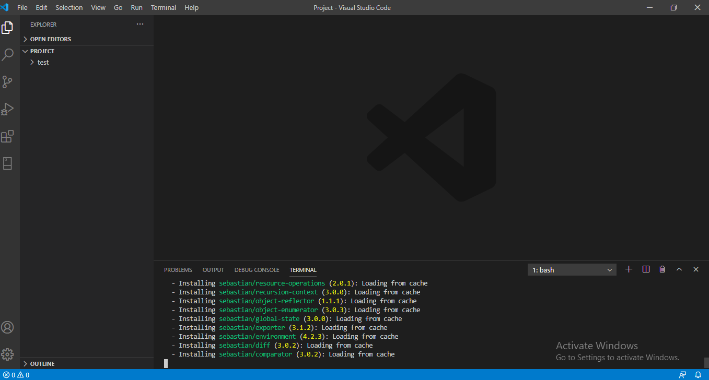

# Create-Laravel-Project
For creating laravel project we have number of methods. One of them is given below 
## Step-1
First  install php through [xammp](https://www.apachefriends.org/download.html)


```
Note: You dont need to install PHP separately. PHP is a part of XAMPP. The version of php must be greater or equal to 7.2

```

To make sure that **PHP** is installed in your computer, open command prompt and Type `php --version`

we can see the php version as below


## Step-2
Download composer package manager from composer offical website [(composer)](https://getcomposer.org).

```
Composer is an application-level package manager for the PHP programming language that provides a standard format for managing dependencies of PHP software and required libraries.
```


To make sure that **composer** is installed in your computer, open command Prompt and Type `composer --version`


## Step-3
Now go to `c://xammp/htdocs` and **create a folder** (In my case Project)


```After creating folder open it by using any editor (In my case vs_code)```


## Step-4
After opening of folder in an editor, open a terminal and Type `composer create-project --prefer-dist laravel/laravel test
`


It will create a laravel project folder with name **test** with all the necessary file required to create a laravel project



## Step-5

After creating laravel project we have to use command `php artisan serve`


```
This command will start a development server at http://localhost:8000:

```

